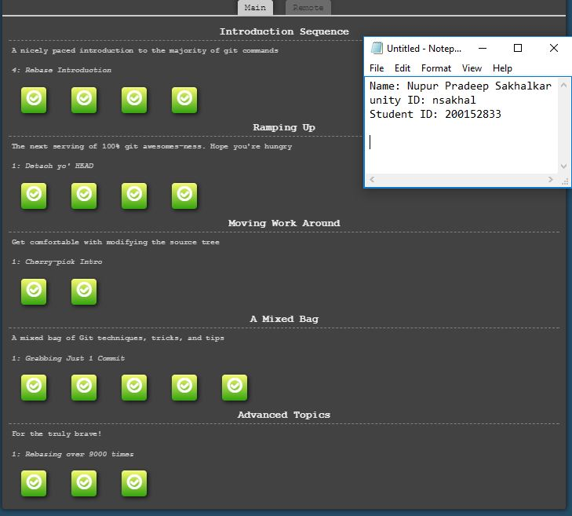

# HW0
1. The completed Moodle and slack profile is as follows:  
[Moodle](https://moodle-courses1718.wolfware.ncsu.edu/user/profile.php?id=100603)  
[Slack](https://csc510-fall2017.slack.com/team/nsakhal)  
2. Screenshot demonstrating completion of the first four levels and advanced topics from the Git tutorial:    
  
4. Link to the screencast video:  

4. post-commit hook script:   
The contents present inside the post-commit file is given [here](post-commit). Also, in order to see the working of the post-commit hook script, [the following steps](post-commit_DEMO_steps.md) should be followed
